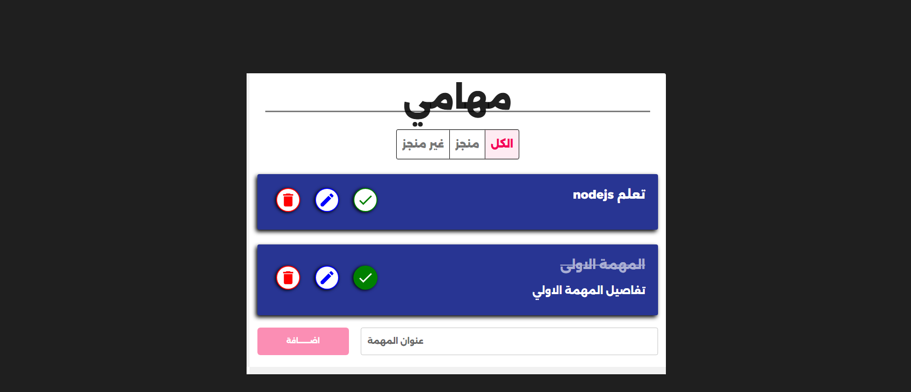

## Overview

This is a feature-rich ToDo List application built using React and Material UI. The project focuses on practicing real-world React concepts such as Context API for state management, component reusability, and local storage persistence.

The application allows users to manage daily tasks efficiently with a clean and responsive UI.

## 🌐 Live Demo
[Click Here](https://majestic-beignet-7f32c4.netlify.app/)

## 📸 Preview




## Features

- Add new tasks
- Edit existing tasks
- Delete tasks with confirmation dialog
- Mark tasks as completed or not completed
- Filter tasks (All / Completed / Not Completed)
- Persistent data using LocalStorage
- Global state management using Context API
- Responsive design for all screen sizes
- Smooth UI interactions and animations

---

## Tech Stack

- React.js
- Material UI (MUI)
- Context API
- UUID
- CSS3
- LocalStorage

---

## Project Structure

- Components-based architecture
- Context for global state management
- Reusable UI components
- Separated styling using CSS

---

## Purpose

This project was built for practicing advanced React fundamentals and improving frontend development skills, especially state management and UI design.

## 👨‍💻 Author

Developed by Sherif Khater
```
