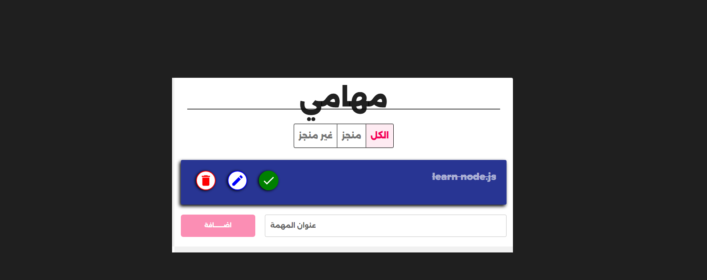

React Todo App

A modern and responsive Todo application built with React and Material UI, featuring scalable state management using Context API and useReducer.

## 🌐 Live Demo
[Click Here](https://dapper-cucurucho-e7afa2.netlify.app/)

## 📸 Preview

## Features

* Add new tasks
* Edit existing tasks
* Delete tasks
* Mark tasks as completed
* Persistent data using Local Storage
* Toast notifications for user actions
* Global state management with Context API + useReducer
* Clean and reusable component structure
* Responsive design for mobile and desktop

## Tech Stack

* React.js
* Context API
* useReducer Hook
* Material UI (MUI)
* CSS3
* UUID
* Local Storage

## State Management

The project uses `useReducer` with Context API to centralize and organize all Todo state logic in a scalable and maintainable way instead of relying on multiple useState hooks.

## Project Structure

* components/
* contexts/
* reducers/
* css/

## Future Improvements

* Drag & Drop functionality
* Task filtering
* Dark mode
* Search functionality
* Backend integration

## Author

Developed by Sherif Khater

